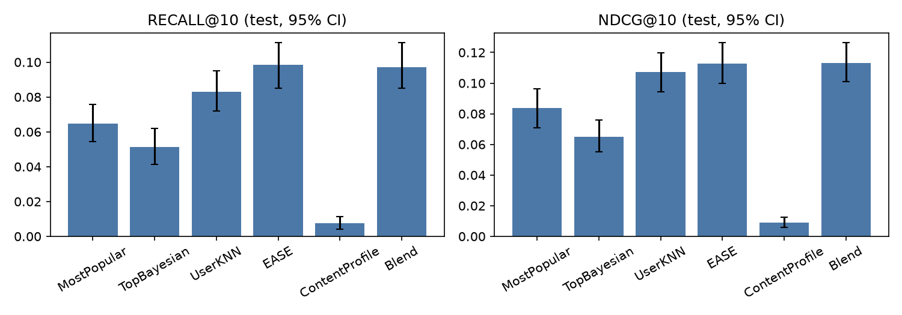

# Report: [Your Name]

**In one paragraph.**
- **Architecture.** The assistant answers from a MovieLens subset through five deterministic tools. The LLM (gpt-4.1-mini) only picks tools and phrases their results. It names movies through ID placeholders, and a verifier checks every answer before the user sees it.
- **Accuracy.** On the held-out test split, used once, the deployed ranking ties with EASE (NDCG@10 0.113) and beats the MostPopular baseline by +0.029 [0.016, 0.041].
- **Honesty.** In the perturbation test, all 6 answers (3 movies, each on the real and the flipped ratings) follow the data, even for famous films.
- **Where it fails.** It inherits the data's flaws: about 6% of plots belong to another film. Seeding with a movie finds films about the same *subject*, not the same *qualities*. The LLM still tends to type titles and to add adjectives from its own movie knowledge. Every number below comes from a saved run in `eval/results/`, and every table is generated by `movie-agent report-tables`.

**How the grades were produced.** The design pre-registered that I would grade the search results and the answer rubric myself. For time reasons they were graded by an **independent LLM grader**: fresh Claude subagents that had not built the system. They were given only the written guidelines and the data, and they did not know which variant produced each search result. Every grade has a written rationale in `eval/grading/`. This deviation is listed with the others at the end.

## Problem Analysis

**Who are the users and what do they need?** The user is a person with a rating history in the dataset, identified by user ID. Histories range from 10 to 1,907 ratings, with a median of 56. They come with three kinds of questions:
- "What should I watch tonight?" (open, personal);
- a request with constraints ("a dark psychological thriller", "like Toy Story but not animated");
- a question about a specific movie or about themselves ("what do people like me think of Pulp Fiction?", "what's my blind spot?").

They need suggestions that fit the request and their taste, and reasons they can check. They also need to be told when the data is too thin to say much.

A second audience matters for a take-home: the reviewers. They need to verify that every claim comes from the data, so the system must be traceable.

**What makes a good conversational recommendation?**
- **Relevant:** it answers what was asked, and constraints accumulate over turns ("no animation" still holds two turns later).
- **Personal:** it comes from this user's history, not generic popularity.
- **Explained with checkable evidence:** "you rated Alien 5.0 and users who rated Alien also rated this", not "a gripping classic".
- **Calibrated:** "only 2 similar users rated it" is a better answer than a confident guess.
- **Short:** 3–5 options, with an offer to go deeper.

**Key technical challenges**, measured on the data (`movie-agent validate`, `eval/results/data_report.json`):
1. **Sparse movies.** 37% of movies have fewer than 3 ratings, and 51% fewer than 5. Collaborative filtering barely sees a third of the catalog, and "quality" is noise for most movies.
2. **Sparse users.** 171 of 610 users have 30 ratings or fewer; the brief's user 30 has 18. One user (53) rated every movie 5.0, so there is no signal about what they prefer.
3. **An LLM that already knows these movies.** gpt-4.1-mini has opinions about Pulp Fiction. The brief asks for answers from the data (requirement R3), so the design has to make "answering from memory" hard to do and easy to detect.
4. **Plot text is a weak and imperfect signal.** Plots describe events, not tone. As the evaluation found, about 6% of them describe a different film.
5. **Evaluation is hard.** Ratings are missing not at random. The judged sets are small (10 queries, 24 scenarios). The LLM is not deterministic even at temperature 0.

## Approach

**How I broke the problem down.** I split the system into layers with one job each, and I evaluate each layer separately so that a failure can be attributed to one of them:

| Layer | Job | Evaluated by |
|---|---|---|
| Data | validation, title resolution, statistics, per-user temporal splits | `validate`; title-resolution unit tests |
| Engines and ranking | EASE, UserKNN and plot embeddings; score the whole catalog; per-feature contributions | offline ranking vs baselines, with bootstrap CIs |
| Tools | 5 tools returning data plus confidence and warnings | unit tests; `why-not` |
| Agent | an LLM loop that picks tools, then a verifier, then a renderer, with state across turns | 24 scenarios, an answer rubric, honesty tests |

The sample queries map to tool chains: "tonight" → `recommend`; "similar taste … Pulp Fiction" → `find_movie` → `peer_opinion`; "why would I like that" → `explain`; "Toy Story but not animated" → `find_movie` → `recommend(seed, exclude_genres)`; "blind spot" → `get_user_profile` → `recommend(include_genres)`.

**Methods and why.**
- **EASE as the recommender:** a closed-form linear item-item model. It is deterministic, typically strong on MovieLens, and its contributions are readable: "your rating of X adds this much to Y".
- **UserKNN for "people like you":** peer questions need real, inspectable neighbours with overlap counts, not latent factors.
- **Plot embeddings for descriptions:** local `bge-small-en-v1.5`. Plots are split into chunks of about 300 tokens, and a movie scores by its best-matching chunk, so a long plot is not diluted and the matched passage can be shown as evidence.
- **One ranking function:** the whole catalog (5,135 movies) is scored per request, so no candidate stage can lose items. Each feature is turned into a rank score within its own top 200, then blended with per-mode weights. Contributions add up to the score, and they are the provenance shown to the LLM and written to the trace.
- **Grounded by construction:**
  - The LLM writes `[[m:ID]]`, never a title.
  - A verifier checks three things: movies came from tool results and no title is typed; recommendations came from `recommend` and respect the constraints; every number appears in the tool outputs.
  - A failing answer gets one retry; if that fails too, a template answer is built from the tool data.
- **Traceable:** a JSONL trace per turn, and `why-not <movie>`, which reruns the ranking and says whether a movie was filtered, ranked below, or never in the catalog.

**Alternatives considered and rejected.**
- **Free-form answers over retrieved context (RAG):** I could not have enforced R3.
- **LangChain-style frameworks:** hide the state and make verification harder.
- **Matrix factorization:** no clear gain over EASE at this size, and less readable explanations.
- **Learning-to-rank:** too few labels.
- **BM25 and query rewriting:** more tuning surface; a rewrite can also smuggle in outside knowledge.
- **Tags as evaluation labels:** 45 people wrote all the tags, and one of them wrote 43%.
- **OpenAI embeddings:** considered mid-build because the model download was slow, then kept local (free, offline, reproducible).
- **The 9-tool, 8-rule first design:** cut to the lean version for the time budget. The cuts are listed in `docs/design.md` §1.3.

### Decision Log

| Decision | Alternative considered | Why I chose this |
|---|---|---|
| The LLM never writes a movie title or a number of its own: tools return the data, movies are `[[m:ID]]` placeholders, and a deterministic verifier checks each answer (with one retry, then a template fallback) | Free-form LLM answers over retrieved data (RAG) | It makes "answers from the data, not LLM knowledge" enforceable and measurable. In the evaluation the verifier blocked every typed title (the main failure), and it stopped an invented movie ID (`[[m:1107]]`, a film no tool had returned) from reaching the user. In the perturbation test all 6 answers followed the data, including the 3 on flipped ratings |
| Blend the features as **rank scores within each feature's top 200**, with no special weights for sparse users (revised after validation) | The first design: percentile ranks over the whole catalog, and extra content weight for sparse users | On validation the first design **lost to its own component** EASE (NDCG@10 0.050 vs 0.102). Percentiles squeeze EASE's top 200 into 0.96–1.00, so small content differences reorder the head, and the sparse-user shift hurt sparse users (0.059 vs 0.076). Top-200 rank scores tie with EASE (val 0.099; test 0.113 vs 0.113) and keep query mode on the query (88% of the top 5 among the 50 best plot matches, vs 46%) |
| Persist excluded genres in code: the orchestrator adds genres excluded in `recommend` to the conversation state (added after grading) | Let the LLM update the state through `final_answer.add_exclude_genres`, as first designed | Prompting alone persisted "no animation" in 4 of 6 turns in one run and 1 of 6 in an identical run. In one trace the follow-up call dropped the constraint and the results contained Toy Story 3. After the change, persistence was 6 of 6 in two runs |

The full log, with ten decisions and their status after validation, is in `docs/design.md` §14.

## Evaluation

**How do I know it works?** Each requirement is measured where it can be isolated, always against baselines and with uncertainty:

| Requirement | Measured by | Why this measure |
|---|---|---|
| R1 personalization | Offline ranking on a per-user temporal split. All unseen movies are ranked (no sampled negatives), with 95% bootstrap CIs over users and paired comparisons | It shows whether personal models beat non-personalized baselines and for whom. The test split was used once (`eval/results/test_runs.log`, commit tagged `final-eval`) |
| Content queries | 10 description queries, top 5 graded 0/1/2 | No labels exist for "dark thriller with a twist", so they have to be judged |
| R2 multi-step, constraints | 24 scenarios (the 6 sample queries × users 1, 15, 30, plus 6 edge cases) with automatic checks, and a 4-criterion rubric | Checks tool choice, grounding, constraint handling and honesty in real conversations |
| R3 data, not LLM knowledge | Perturbation test and explanation fidelity | It is the only direct test: if the data changes, does the answer change? Do the stated reasons really drive the ranking? |

Relevance for ranking means a held-out rating of at least 4.0. The user-relative definition (rating ≥ the user's mean + 0.5) is also reported in the results. It gives the same picture: the three CF systems are well ahead of MostPopular, which is ahead of TopBayesian and the content profile. UserKNN edges ahead of EASE there.

### Offline ranking (test split, used once)

<!-- table:offline -->
*Source: Offline ranking (test, K = 10, 590 users) — `2026-09-27_offline_test`*

| System | Recall@K | NDCG@K | Tail recall | Coverage | Pop. ratio |
|---|---|---|---|---|---|
| MostPopular | 0.065 [0.054, 0.076] | 0.084 [0.071, 0.096] | 0.000 [0.000, 0.000] | 0.018 | 3.43 |
| TopBayesian | 0.051 [0.041, 0.062] | 0.065 [0.055, 0.076] | 0.000 [0.000, 0.000] | 0.010 | 2.29 |
| UserKNN | 0.083 [0.072, 0.095] | 0.107 [0.094, 0.120] | 0.000 [0.000, 0.000] | 0.033 | 2.64 |
| EASE | 0.098 [0.085, 0.111] | 0.113 [0.100, 0.126] | 0.000 [0.000, 0.000] | 0.085 | 2.13 |
| ContentProfile | 0.008 [0.004, 0.011] | 0.009 [0.006, 0.013] | 0.008 [0.002, 0.017] | 0.084 | 0.18 |
| Blend | 0.097 [0.085, 0.111] | 0.113 [0.101, 0.127] | 0.003 [0.000, 0.009] | 0.074 | 2.27 |

| Comparison | Metric | Mean difference [95% CI] | Significant |
|---|---|---|---|
| Blend - EASE | recall | -0.001 [-0.011, 0.007] | no |
| Blend - EASE | ndcg | 0.000 [-0.008, 0.009] | no |
| EASE - MostPopular | recall | 0.034 [0.021, 0.047] | yes |
| EASE - MostPopular | ndcg | 0.029 [0.016, 0.041] | yes |
<!-- /table:offline -->

- **Personalization works, modestly.** EASE reaches NDCG@10 0.113, significantly above MostPopular (0.084, paired difference +0.029 [0.016, 0.041]), which is itself a strong baseline, as expected on MovieLens. The deployed Blend ties with EASE (difference 0.000 [−0.008, 0.009]): it adds nothing measurable. Its content and quality features cost no accuracy and supply the plot evidence used in explanations.
- **UserKNN is close** (0.107). For users with long histories it is slightly ahead (0.148 vs 0.142 for EASE in the top tercile, overlapping CIs). It exists for peer questions, so its accuracy is a bonus.
- **Popularity bias.** Movies recommended by EASE and the Blend are 2.1–2.3 times as popular as the movies in the user's own history. Tail recall is essentially 0 for every collaborative system (the Blend gets 0.003). Only the content profile finds tail movies (0.008), and it is poor overall (0.009).

<!-- table:segments -->
*Source: NDCG@10 by train-history tercile (cut points 28, 79 ratings) — `2026-09-27_offline_test`*

| System | small | medium | large |
|---|---|---|---|
| MostPopular | 0.078 [0.057, 0.103] | 0.068 [0.052, 0.086] | 0.106 [0.086, 0.127] |
| TopBayesian | 0.056 [0.038, 0.077] | 0.049 [0.035, 0.065] | 0.090 [0.072, 0.111] |
| UserKNN | 0.080 [0.062, 0.099] | 0.094 [0.073, 0.114] | 0.148 [0.123, 0.175] |
| EASE | 0.109 [0.084, 0.135] | 0.087 [0.068, 0.107] | 0.142 [0.118, 0.169] |
| ContentProfile | 0.013 [0.005, 0.023] | 0.003 [0.001, 0.006] | 0.011 [0.006, 0.016] |
| Blend | 0.107 [0.084, 0.130] | 0.092 [0.072, 0.114] | 0.140 [0.114, 0.165] |
<!-- /table:segments -->

- For users with little history (the bottom tercile, 28 train ratings or fewer), EASE and the Blend still beat MostPopular (0.109 and 0.107 vs 0.078). The pre-registered expectation that content would help sparse users was **not** confirmed: the Blend is no better than EASE there.
- Pre-registered expectations, checked:
  - MostPopular is strong: confirmed (it beats TopBayesian).
  - EASE is the most accurate: confirmed, tied with the Blend.
  - Content matters more for the tail and for sparse users: confirmed for the tail only.

### Content search

<!-- table:search -->
*Source: Content search (10 queries) — `2026-09-27_search_2`*

| Variant | P@5 | Mean grade (0–2) | Mean Bayesian avg | Share < 5 ratings |
|---|---|---|---|---|
| plain | 0.84 [0.72, 0.94] | 1.32 [1.08, 1.52] | 3.65 | 0.26 |
| plain_min0 | 0.88 [0.78, 0.96] | 1.38 [1.18, 1.56] | 3.64 | 0.42 |
| personal_u15 | 0.74 [0.58, 0.88] | 1.14 [0.94, 1.36] | 3.71 | 0.16 |
<!-- /table:search -->

<!-- table:search_failures -->
*Source: Search grades by query (LLM-graded) — `eval/grading/search_grades_with_rationale.csv`*

| Query | Pairs | Mean grade | genre_only | other | partial_element | title_word | wrong_tone |
|---|---|---|---|---|---|---|---|
| q01_dark_twist | 8 | 1.38 | 0 | 0 | 2 | 1 | 1 |
| q02_unlikely_friends | 9 | 1.11 | 0 | 1 | 3 | 1 | 1 |
| q03_bleak_loneliness | 8 | 0.75 | 0 | 2 | 3 | 2 | 0 |
| q04_road_trip | 7 | 1.29 | 1 | 0 | 2 | 0 | 1 |
| q05_heist_crew | 6 | 1.50 | 0 | 0 | 3 | 0 | 0 |
| q06_time_travel | 8 | 1.12 | 1 | 2 | 1 | 0 | 0 |
| q07_wrongly_accused | 7 | 1.29 | 0 | 2 | 1 | 0 | 0 |
| q08_space_survival | 10 | 0.70 | 4 | 0 | 5 | 0 | 0 |
| q09_war_romance | 7 | 1.57 | 0 | 0 | 3 | 0 | 0 |
| q10_haunted_house | 9 | 1.33 | 2 | 0 | 2 | 0 | 0 |
| all | 79 | 1.18 | 8 | 7 | 25 | 4 | 3 |
<!-- /table:search_failures -->

- **Concrete plot queries work** (heist 1.50, war romance 1.57): Heat, Ocean's Eleven, Back to the Future, Poltergeist, Doctor Zhivago. **Mood and abstract queries do not.** "A bleak, atmospheric film about loneliness" scores 0.75. "Survival in space after an accident" (0.70) returns space operas whose ships are damaged in battle.
- The dominant failure type is `partial_element` (25 of 47 grades below 2): one part of the request matches and another is missing. Title-word matches, from the "Title. Genres." prefix of each chunk, explain only 4.
- Removing the default `min_ratings = 3` filter does not help significantly (P@5 0.88 vs 0.84), and it raises the share of barely rated results from 26% to 42%, so the filter stays.
- Personalizing the search (user 15) lowers relevance slightly (0.74, not significant), because the CF feature pulls in the user's favourites that match the query less.

### Agent scenarios

<!-- table:agent -->
*Source: Agent scenarios (24 scenarios, 29 turns) — `2026-09-27_agent_4`*

| Metric | Value |
|---|---|
| scenario_success | 0.792 |
| tool_chain_accuracy | 1.000 |
| verifier_first_pass_rate | 0.793 |
| fallback_rate | 0.000 |
| constraint_satisfaction | 1.000 |
| state_persistence | 1.000 |
| mean_tool_calls | 1.414 |
| mean_tokens | 6576.172 |
| p50_latency_ms | 2871.500 |
| p95_latency_ms | 4723.580 |

| Rubric criterion (0–2) | Mean | Graded turns |
|---|---|---|
| grounded | 1.45 | 29 |
| relevant | 1.97 | 29 |
| specific | 1.72 | 29 |
| honest | 1.90 | 29 |
<!-- /table:agent -->

Every scenario run, in order:
- the Step 1 run (draft ranking, prompt v1);
- prompt v1 on the revised ranking;
- prompt v2, run twice (only a verifier fix differs, and it does not affect these turns);
- after the two graded fixes (D9, D10), run twice.

`-dirty` marks runs made on uncommitted changes, which were committed right after.

<!-- table:agent_runs -->
*Source: All agent runs*

Rubric columns are means (0–2) where the run was graded (by an LLM grader, see notes).

| Run | Prompt | Commit | verifier_first_pass_rate | fallback_rate | state_persistence | scenario_success | rubric grounded | rubric relevant | rubric specific | rubric honest |
|---|---|---|---|---|---|---|---|---|---|---|
| `2026-09-26_agent` | system_v1 | 6ef7177-dirty | 0.52 | 0.03 | 0.00 | 0.46 | - | - | - | - |
| `2026-09-27_agent` | system_v1 | c315916-dirty | 0.48 | 0.10 | 0.00 | 0.50 | - | - | - | - |
| `2026-09-27_agent_2` | system_v2 | c315916-dirty | 0.79 | 0.00 | 0.67 | 0.67 | - | - | - | - |
| `2026-09-27_agent_3` | system_v2 | c315916-dirty | 0.86 | 0.03 | 0.17 | 0.71 | 1.45 | 1.86 | 1.66 | 1.45 |
| `2026-09-27_agent_4` | system_v2 | 03ffabb | 0.79 | 0.00 | 1.00 | 0.79 | 1.45 | 1.97 | 1.72 | 1.90 |
| `2026-09-27_agent_5` | system_v2 | 03ffabb | 0.76 | 0.00 | 1.00 | 0.75 | - | - | - | - |
<!-- /table:agent_runs -->

- **Tool choice was right in every turn of every run** (tool-chain accuracy 1.00), including the edge cases:
  - The Matrix is reported as absent from the dataset.
  - "Psycho" gets a clarifying question listing the 1960 film and the 1998 remake.
  - "Just use what you know" is declined.
  - For a niche movie with no peer ratings, the answer says so.
- **The main LLM failure is typing movie titles.** Every verifier rejection in the final runs was a typed title, and every one was recovered by the retry. Prompt v2 raised the first-pass rate from 0.48 to about 0.8 and cut the fallback rate from 0.10 to 0.00–0.03.
- **Run-to-run variance is real.** Two identical runs of v2 gave state persistence 0.67 and 0.17, which is why that fix moved into code (see the decision log). After the change it was 1.00 in both runs.
- **Rubric (LLM grader)** after the two fixes: relevant 1.97, specific 1.72, honest 1.90, **grounded 1.45**. The run before the fixes was graded by another grader instance, so the change is indicative only. Groundedness is the weak point. Its six zeros come from two causes:
  - calling a history movie "liked" when the user rated it 1.0–2.5 (failure case 3);
  - outside knowledge leaking in through adjectives or premises ("a classic thriller", "each film has a twist").

  The verifier cannot see either one, because neither involves a number or a title.

### Honesty tests

<!-- table:honesty -->
*Source: Honesty tests — `2026-09-27_honesty_2`*

| Test | Result |
|---|---|
| Fidelity: top driver removed → recommendation drops | 0.27 [0.10, 0.43] (n = 30) |
| Control: random history movie removed | 0.00 [0.00, 0.00] |
| Perturbation: pairs where the data flipped | 3 of 3 |
| LLM answer names the engine's top driver | 0.9 (n = 10) |
| Perturbation (graded): answer stance follows the data | 6 of 6 |
| Perturbation (graded): answers adding facts beyond tool outputs | 0 of 6 |
| Attribution (graded): stated reason matches the top driver | yes 5, partly 4, no 1 (n = 10) |
<!-- /table:honesty -->

- **Perturbation (the direct R3 test).** For three users I took a movie they had not rated (Terminator 2, Jurassic Park, Forrest Gump). In a copy of the data, the ratings of that movie by the user's 50 most similar users were flipped (r → 5.5 − r), and I asked "what do people with similar taste think about it?" on both versions. In all 6 answers the stance followed the data, and no answer added facts beyond the tool output. For Terminator 2 and user 1, the answer on the real data said "an average rating of 4.04, which is 0.55 above their own average ratings. About 71.1% of these similar users liked it". After the flip it said "quite low, with an average rating of 1.46, which is 2.01 points below their own average ratings. Only about 2.6% of these similar users liked the movie". The agent does not fall back on the film's reputation.
- **Explanation fidelity.** I removed the top driver named by `explain` from the user's history and re-ranked. The recommendation fell at least 5 places in 27% of cases [10%, 43%]. Removing a random history movie did that in 0% of cases, and the driver's removal cut the score 13 times more (0.091 vs 0.007). The named reason is real, but it is rarely decisive on its own, because EASE sums over the whole history. "Because you liked X" should be read as "X is the largest single contributor".
- **Attribution.** The LLM's stated reason matched the engine's top driver in 5 of 10 answers, partly in 4. The one "no" was a fallback answer that gave no reason at all.

### Failure Analysis

The three cases below come from the curated `chat` sessions (`transcripts/`, traces in `traces/examples/`). The engine-only evidence is in `eval/results/2026-09-27_failure_evidence/`.

**1. "I liked Toy Story but I'm tired of animated movies — what else?" returns toy and Christmas films.**
- *What the system recommended.* For user 15 the engine's top 5 are E.T., Snatch, Toys, Santa Claus: The Movie and Jingle All the Way. For user 1 they are Gremlins, Babe, Snatch, The Santa Clause and Santa Claus: The Movie.
- *Why.*
  - In seed mode the strongest feature is plot similarity to Toy Story, with weight 0.5. The plot embedding captures Toy Story's literal **subject** (toys, children, Christmas presents), not the qualities the user liked (humor, adventure, friendship).
  - Toys (20 ratings, mean 2.38), Santa Claus: The Movie (4 ratings, mean 2.25) and Jingle All the Way reach the top 5 on the seed feature alone, with no collaborative and no quality contribution.
  - `why-not --user 15 --movie "The Princess Bride" --seed 1 --exclude-genres Animation` gives `RANKED_BELOW` at rank 31, largest gap `seed`. Its collaborative (0.258) and quality (0.196) contributions are strong, but it is not among Toy Story's 200 nearest plots, so it loses to Jingle All the Way, which scores 0.495 on plot similarity and nothing else.
  - The LLM added its own failures in the long sessions. For user 30 it carried the previous turn's query ("dark psychological thriller with a twist") into this request. For user 15 it never looked up Toy Story, so no seed was used. It then typed titles in both attempts and got the template fallback.
- *Root cause.* R (feature and weights) and S (embedding captures the subject), plus U (wrong tool arguments) on the agent side.
- *What would fix it.*
  - Base the seed similarity on collaborative data: run EASE with the seed as the history. That finds what people who liked Toy Story also rated.
  - Or require a minimum cf or quality score before a movie can win on plot similarity alone.
  - Keep the seed movie in the conversation state, and clear the previous query when a new request starts.

**2. "I want a dark psychological thriller with a twist" returns Psycho (1960) on the plot of another film: grounded, but wrong.**
- *What the system recommended.* Rank 2 was Psycho (1960). Its matched passage reads "a young man who prefers a lonely life. He begins to stalk a television anchor named Pavana…". That is not the 1960 film. Twelve Monkeys, at rank 3, carries the plot of a film with a Greek chorus and a sportswriter named Lenny Weinrib. The answer called Psycho "a classic crime and horror thriller" (user 15, turn 4).
- *Why.*
  - The dataset attaches some plots to the wrong movie. A seeded audit of 100 plots (the 50 most-rated movies and 50 random ones, `eval/grading/plot_audit.csv`) found **6 mismatches, 95% CI [2.8%, 12.5%]**. It is a lower bound, because only confident cases were counted.
  - The mismatches include very popular titles: Seven carries The Land Before Time III, Independence Day carries Day Watch, and Men in Black carries a Baltimore legal drama.
  - The system trusts the data by design, so every check passes: the excerpt really is in the data. Meanwhile the LLM "knows" Psycho and papers over the mismatch with an adjective from memory.
  - This audit is the only place outside knowledge was used, and only to check the data.
- *Root cause.* D (data), plus G (outside knowledge in the wording).
- *What would fix it.*
  - Flag plots that disagree with the movie's other evidence, for example a plot vector far from the plots of the movies it is co-rated with, or far from its genres. Show "plot may not match" instead of the excerpt.
  - Add a check, a judge or the rubric, for descriptive claims that no tool output supports.

**3. "What should I watch tonight?" says "recommended because you liked Django Unchained", which the user rated 1.0.**
- *What the system recommended.* For user 15, Inglourious Basterds is "recommended because you liked Inception and Django Unchained" (rated 3.5 and **1.0**), and Good Will Hunting "because you liked … Fight Club" (rated 2.5).
- *Why.*
  - EASE is fitted on which movies a user rated, not on how they rated them, so rating Django Unchained at all pushes up similar films.
  - `because_you_rated` lists the largest contributions whatever the rating. The tool output includes `user_rating: 1.0`, but the LLM paraphrases "rated" as "liked".
  - The verifier checks titles and numbers, not verbs, so it passes. The same pattern produced three of the six "grounded = 0" rubric scores.
- *Root cause.* G (misstatement), enabled by R (binary EASE).
- *What would fix it.*
  - List only history movies rated at or above the user's own mean as reasons. This is cheap, but it makes the explanations less faithful to the model.
  - Or fit EASE on liked-only interactions, which needs a val ablation.
  - Add a prompt rule to say "you rated X 1.0" rather than "you liked X".

## Reflection

**What works well.**
- **Grounding holds where it can be enforced.** No invented movie reached a user, a hallucinated ID was blocked, and constraints were satisfied in every scenario run. The perturbation test shows the answers follow the data, not the films' reputations.
- **Traceability paid off repeatedly:**
  - The Blend losing to EASE was diagnosed from the per-feature contributions.
  - The state bug and the confidence gap were confirmed by reading one trace each.
  - A verifier false positive ("2.3 below their average" rejected because the tool said −2.3) was found by the perturbation test and fixed with regression cases.
- **The collaborative core is solid and simple:** a closed-form model with no training loop, and deterministic.

**What does not work well, and why.**
- **Beyond-popularity discovery is weak.** Tail recall is near 0 and recommendations are twice as popular as the user's history. EASE learns from co-occurrence, and a third of the catalog has almost no ratings.
- **Content understanding is shallow.** Plots describe events, the embedding matches subjects, and some plots are for the wrong film. Mood queries and seed requests suffer most.
- **The LLM's wording is the least controlled part.** Typed titles are caught, but adjectives from its own knowledge and "liked" for a 1.0 rating are not. The verifier only covers what can be checked mechanically.
- **The evidence has limits.**
  - The grades come from an LLM grader, not from me.
  - The sets are small (10 queries, 29 turns).
  - Agent metrics move between identical runs.
  - Offline metrics treat unrated as irrelevant, which favours popular movies.

**What I would do with more time.**
- **Quick fixes:**
  - collaborative seed similarity (case 1);
  - a plot-consistency flag (case 2);
  - reasons limited to liked movies, plus a liked-only EASE ablation (case 3);
  - per-tool fallback templates.
- **Stronger evidence:**
  - run each scenario several times and report means with intervals;
  - regrade a random 20% myself to measure agreement with the LLM grader;
  - grade more queries;
  - run a small user study, because offline metrics do not measure usefulness in conversation.
- **Things cut from the first design:** a hybrid BM25 + embedding search, a cross-encoder re-ranker for search, and an answer-level judge for unsupported descriptive claims, calibrated against my own grades.

## Open Section

**Findings about the data** (all from `movie-agent validate` except the plot audit):
- **Validation is clean:** zero ratings for unknown movies, zero duplicates, no plot under 100 characters, no missing year.
- **Genres:** there are 20 genre labels, not the 19 the brief says. `IMAX` (84 movies) is a format, not a genre, and 3 movies have `(no genres listed)`. Both are excluded from taste analysis.
- **Tags** come from only 45 users, and one user wrote 1,056 of the 2,440. The most common tag, "in netflix queue", is a to-do list rather than a description. That is why tags were not used as evaluation labels.
- **Split ties:** for 120 of 610 users, the train/test boundary falls inside a block of ratings with identical timestamps. The order within those blocks is arbitrary, so their split is partly random rather than temporal.
- **Plots:** about 6% of plots describe another film (failure case 2).

**Deviations from the pre-registered protocol**, all logged in `docs/notes.md` as they happened:
1. The search and rubric grades were produced by an LLM grader instead of me (see the top of this report).
2. The ranking normalization and the sparse-user rule were changed after the first validation run. The test split was untouched, and the chosen variant was not the validation maximum: z-score scored 0.102 but broke query mode.
3. The ungraded search sheet was reset after the ranking change, so that only the current results were graded.
4. A first search run with a display bug and no grades was deleted and re-run.

The test split was evaluated exactly once, from a clean commit (`eval/results/test_runs.log`).

**Cost and speed.** gpt-4.1-mini uses about 7k tokens per turn. Median latency is 2.6–2.9 s and the 95th percentile 4.7–5.8 s, including verification and the occasional retry.

**Tools used.** The code was written with Claude Code. The LLM grading and the plot audit were done by Claude subagents. The assistant itself runs on OpenAI gpt-4.1-mini. The design, the decisions and their evidence are in `docs/design.md` and `docs/notes.md`.
